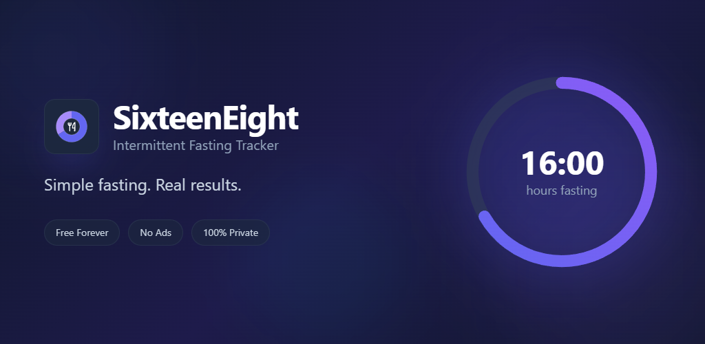

  

  

## Reporting Bugs

Found a bug? We'd love to hear about it! Don't have a github account? No worries, you can post in the [subreddit](https://www.reddit.com/r/SixteenEight/) as well. Though an issue will eventually be created here for tracking.

Please include:

- **Device**: (e.g., Samsung Galaxy S23, Pixel 8)
- **Android Version**: (e.g., Android 14)
- **App Version**: (found in Settings > About)
- **Description**: What happened?
- **Expected Behavior**: What should have happened?
- **Steps to Reproduce**: How can we recreate the issue?

## Feature Requests

Have an idea to make SixteenEight better? Open a feature request and include:

- **Description**: What feature would you like?
- **Use Case**: Why would this be helpful?

## Supported Platforms

- **Android**: Available on [Google Play Store](https://play.google.com/store/apps/details?id=com.sixteeneight.app)
- **iOS**: Coming soon
- **Website**: [sixteeneight.app](https://sixteeneight.app)

## Privacy Note

SixteenEight is 100% private - all your data stays on your device. When reporting issues, please don't include any personal health data. Generic descriptions are fine!

## Support Development

If you enjoy SixteenEight, consider [sponsoring on GitHub](https://github.com/sponsors/lzinga)!

---

Thank you for helping make SixteenEight better!
